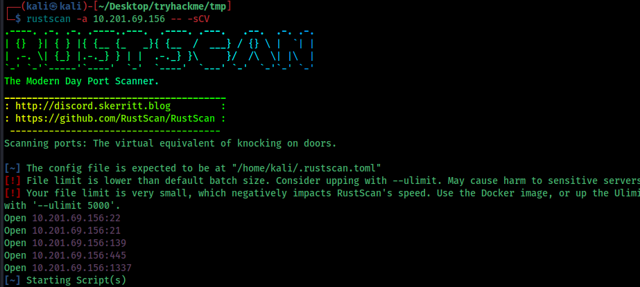

# NerdHerd




we can see some intersting ports in here
 port 21 ftp with anonymous login in available. before diving on to the website collect the information from the ftp 

```  PORT     STATE SERVICE     REASON  VERSION
21/tcp   open  ftp         syn-ack vsftpd 3.0.3
| ftp-anon: Anonymous FTP login allowed (FTP code 230)
|_drwxr-xr-x    3 ftp      ftp          4096 Sep 11  2020 pub
| ftp-syst: 
|   STAT: 
| FTP server status:
|      Connected to ::ffff:10.17.86.42
|      Logged in as ftp
|      TYPE: ASCII
|      No session bandwidth limit
|      Session timeout in seconds is 300
|      Control connection is plain text
|      Data connections will be plain text
|      At session startup, client count was 3
|      vsFTPd 3.0.3 - secure, fast, stable
|_End of status
22/tcp   open  ssh         syn-ack OpenSSH 7.2p2 Ubuntu 4ubuntu2.10 (Ubuntu Linux; protocol 2.0)
| ssh-hostkey: 
|   2048 0c:84:1b:36:b2:a2:e1:11:dd:6a:ef:42:7b:0d:bb:43 (RSA)
| ssh-rsa AAAAB3NzaC1yc2EAAAADAQABAAABAQCYrqlEH/5dR4LGfKThK3BQuCVPxx91asS9FfOewAooNFJf4zsESd/VCHcfQCXEHucZo7+xdceZklC7PwhzmybjkN79iQcd040gw5kg0htMWuVzdzcVFowV0hC1o7Rbze7zLya1B1C105aEoRKVHVeTx0ishoJfJlkJBlx2nKrKWciDYbJQvG+1TxEJaEM4KkmkO31y0L7C3nsdaEd+Z/lNIo6JfbxwrOb6vBonPLS/lZDJdaY0vrdZJ81FRiMbSuUIj3lEtDAZNWBTwXx5kO3fwodw4KbS0ukW5srZX5TLmf/Q/T8ooCnJMLvaksIXKl0r8fjJIx0QucoCwhCTR2o1
|   256 e2:5d:9e:e7:28:ea:d3:dd:d4:cc:20:86:a3:df:23:b8 (ECDSA)
| ecdsa-sha2-nistp256 AAAAE2VjZHNhLXNoYTItbmlzdHAyNTYAAAAIbmlzdHAyNTYAAABBBNSB3jALoSxl/A6Jtpf21NoRfbr8ICR6FpH+bbprQ17LUFUm6pUrhDSx134JBYKLOfFljhNKR57LLS6LAK0bKB0=
|   256 ec:be:23:7b:a9:4c:21:85:bc:a8:db:0e:7c:39:de:49 (ED25519)
|_ssh-ed25519 AAAAC3NzaC1lZDI1NTE5AAAAII4VHJRelvecImJNkkZcKdI+vK0Hn1SjMT2r8SaiLiK3
139/tcp  open  netbios-ssn syn-ack Samba smbd 3.X - 4.X (workgroup: WORKGROUP)
445/tcp  open  netbios-ssn syn-ack Samba smbd 4.3.11-Ubuntu (workgroup: WORKGROUP)
1337/tcp open  http        syn-ack Apache httpd 2.4.18 ((Ubuntu))
| http-methods: 
|_  Supported Methods: GET HEAD POST OPTIONS
Service Info: Host: NERDHERD; OSs: Unix, Linux; CPE: cpe:/o:linux:linux_kernel

Host script results:
| smb-os-discovery: 
|   OS: Windows 6.1 (Samba 4.3.11-Ubuntu)
|   Computer name: nerdherd
|   NetBIOS computer name: NERDHERD\x00
|   Domain name: \x00
|   FQDN: nerdherd
|_  System time: 2025-08-20T17:57:24+03:00
| p2p-conficker: 
|   Checking for Conficker.C or higher...
|   Check 1 (port 36590/tcp): CLEAN (Couldn't connect)
|   Check 2 (port 58225/tcp): CLEAN (Couldn't connect)
|   Check 3 (port 20635/udp): CLEAN (Failed to receive data)
|   Check 4 (port 20140/udp): CLEAN (Failed to receive data)
|_  0/4 checks are positive: Host is CLEAN or ports are blocked
|_clock-skew: mean: -59m58s, deviation: 1h43m49s, median: -5s
| smb-security-mode: 
|   account_used: guest
|   authentication_level: user
|   challenge_response: supported
|_  message_signing: disabled (dangerous, but default)
| smb2-time: 
|   date: 2025-08-20T14:57:18
|_  start_date: N/A
| nbstat: NetBIOS name: NERDHERD, NetBIOS user: <unknown>, NetBIOS MAC: <unknown> (unknown)
| Names:
|   NERDHERD<00>         Flags: <unique><active>
|   NERDHERD<03>         Flags: <unique><active>
|   NERDHERD<20>         Flags: <unique><active>
|   \x01\x02__MSBROWSE__\x02<01>  Flags: <group><active>
|   WORKGROUP<00>        Flags: <group><active>
|   WORKGROUP<1d>        Flags: <unique><active>
|   WORKGROUP<1e>        Flags: <group><active>
| Statistics:
|   00:00:00:00:00:00:00:00:00:00:00:00:00:00:00:00:00
|   00:00:00:00:00:00:00:00:00:00:00:00:00:00:00:00:00
|_  00:00:00:00:00:00:00:00:00:00:00:00:00:00
| smb2-security-mode: 
|   3:1:1: 
|_    Message signing enabled but not required

```


download these files

i didnt get much info from these by exif tool , there is one username that we can use maybe


lets dive into the web page


we can see there is an admin directory is there that could be useful


login or registring as a user is not working so the only info we ca get from here is 


this encoded text is a rabbithole

we only know owner name which is

``` fijbxslz ```

i used enum4linux to enumerate more


we can see a username which is ```chuck ```

and a share folder ``` nerdherd_classified ```

only we need is a password. i have tried brutefore but no luck.

i was stuck here for a while so i have checked on discord for some hint and the decryption key for ```fijbxslz ``` was ``` birdistheword ```


username : chuck
password: easypass

try to login to the smb shares


download the file

``` ┌──(kali㉿kali)-[~/Desktop/tryhackme/tmp]
└─$ cat secr3t.txt                          
Ssssh! don't tell this anyone because you deserved it this far:

	check out "/this1sn0tadirect0ry"

Sincerely,
	0xpr0N3rd
<3
```

so we have a directory to check in 


```chuck : th1s41ntmypa5s```

we can get the ssh password from here


```──(kali㉿kali)-[~/Desktop/tryhackme/tmp]
└─$ ssh chuck@10.201.69.156
chuck@10.201.69.156's password: 
Welcome to Ubuntu 16.04.1 LTS (GNU/Linux 4.4.0-31-generic x86_64)

 * Documentation:  https://help.ubuntu.com
 * Management:     https://landscape.canonical.com
 * Support:        https://ubuntu.com/advantage

747 packages can be updated.
522 updates are security updates.

Last login: Wed Oct 14 17:03:42 2020 from 22.0.97.11
chuck@nerdherd:~$ ls
Desktop    Downloads         Music                Pictures  Templates  Videos
Documents  examples.desktop  nerdherd_classified  Public    user.txt
chuck@nerdherd:~$ cat user.txt
THM{7fc91d70e22e9b70f98aaf19f9a1c3ca710661be}
chuck@nerdherd:~$ 
```
 we got the user flag

 

 i have uploaded linpeas to the machine to enumerate more

 