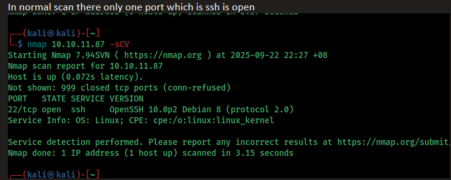

# Expressway

During an initial scan, only the SSH port appears to be open.



To enumerate further, run:

```bash
sudo nmap -p 1-1000 10.10.11.87 -sS -Pn -d3
```

This helps identify all closed and UDP ports.

We discover:

```
500/tcp  closed isakmp  reset ttl 63
```

This is interesting.

ISAKMP stands for Internet Security Association and Key Management Protocol. It is used to establish, negotiate, and manage security associations (SAs) for IPsec connections.

---

## Exploiting ISAKMP


I used `ike-scan` to enumerate further.

We find a username and domain:  
`ike@expressway.htb`  
Add this to `/etc/hosts` for easier access.

---

## Cracking Credentials

There are several methods to crack the credentials.


You can use either approach to obtain the password.


---

## SSH Access

Once you have the username and password, try accessing SSH.


---

## Privilege Escalation

I ran LinPEAS on the machine to identify vulnerabilities.


A vulnerability in `sudo` was discovered:

**CVE‑2025‑32463**  
Reference: [GitHub - CVE-2025-32463](https://github.com/junxian428/CVE-2025-32463)


Transfer the exploit payload to your attack box and proceed with privilege escalation.