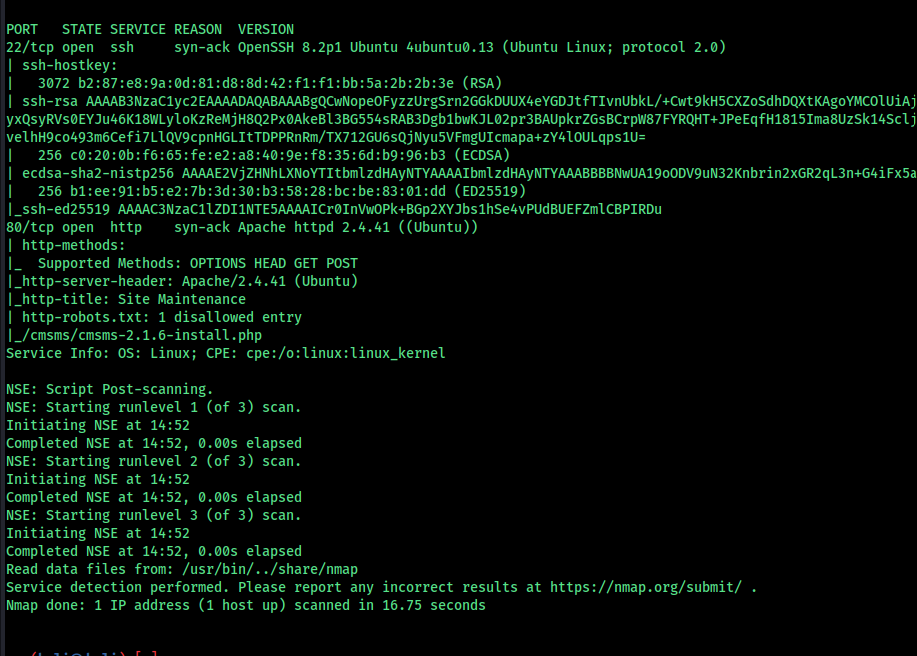

#toc2

ssh and http is open, enumerat http and get initial footstep

run a directory scan 
we got something "cmsmsuser:devpass" i dont know what it is maybe some credentials for cms user

we have robots.txt

go to "/cmsms/cmsms-2.1.6-install.php" this path

its a CMS Made Simple™ 2.1.6 so search for any exploits that we can exploait

CMS Made Simple 2.1.6 - Remote Code Execution                                      | php/webapps/44192.txt
we can use this

fill this with the info we got and turn on the proxy to eploit

we can execute payloads with this packet

replace the timezone with "'junk';echo%20system($_GET['cmd']);$junk='junk&next=Next+%E2%86%92" this code

here we go

we have some files here read them to get some info

so we got a username and a password

frank:password

we go the user flag , now we have to escalte the privilege

https://github.com/sroettger/35c3ctf_chals/blob/master/logrotate/exploit/rename.c

we have this link on the hint

the program readcard needs a file to input

nothing worked so we can use this rename.c to exploit this

exploit using the race condition

root: thm{7265616c6c696665}